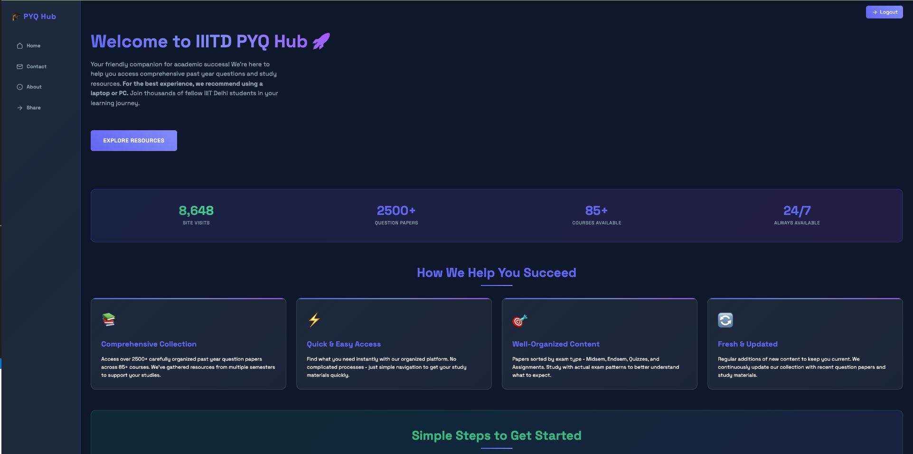
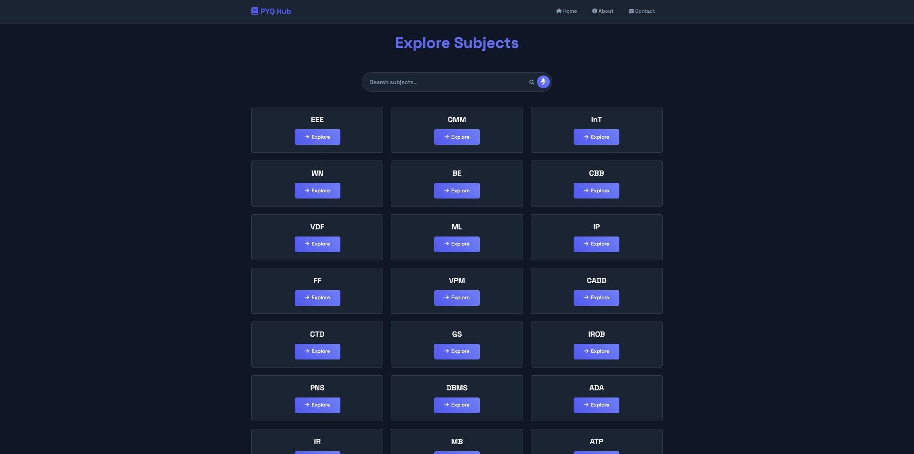
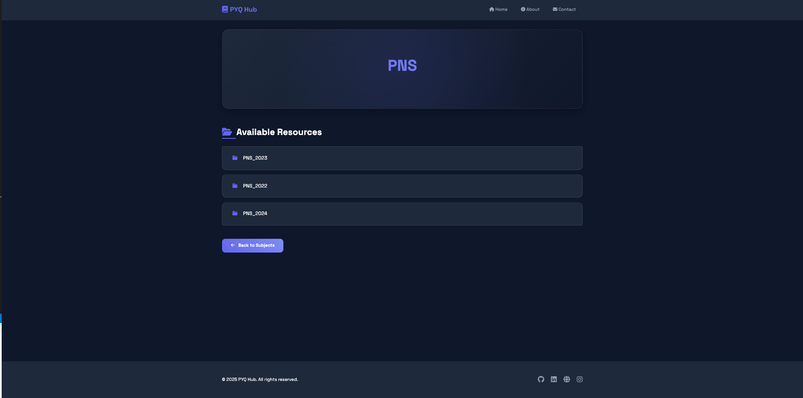
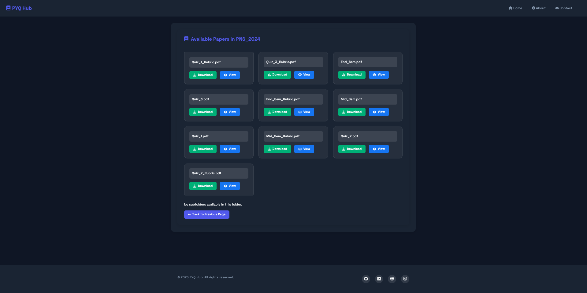
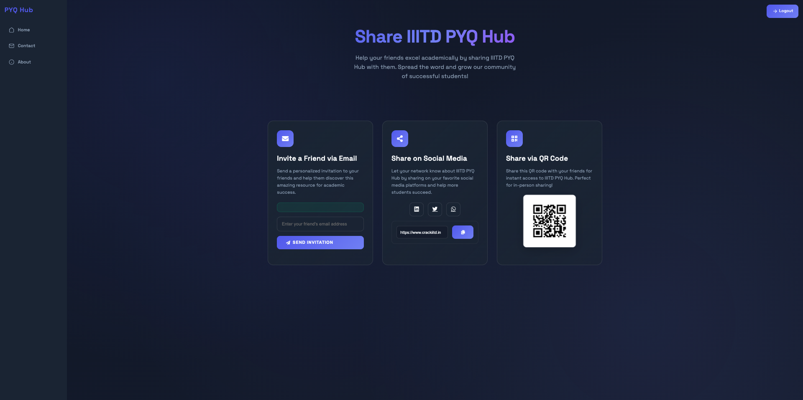
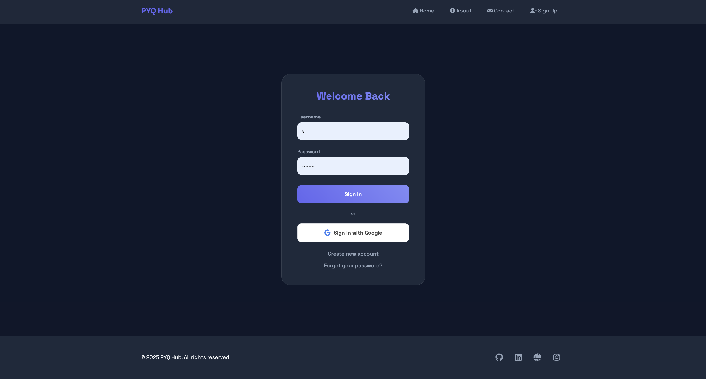

# CrackIIITD — The PYQ Hub of IIIT-Delhi

## Summary

CrackIIITD is a centralized, student-friendly platform built to simplify access to past year question papers (PYQs) at IIIT-Delhi. By integrating with Google Classroom and using automation techniques, the platform gathers and organizes question papers across all courses and years — solving the age-old “where are the PYQs?” problem for students.

---

## The Story Behind

During my 2nd semester, I noticed how every student at IIITD struggles with finding PYQs when exams approach. While they are essential for preparation, they are scattered across Google Drives, WhatsApp chats, and Telegram groups. Many of these links get deleted or lost.

So, I created CrackIIITD — a hub where students can **search, browse, and access all PYQs with just a few clicks**, backed by automation and smart file handling.

---

## 🧭 Pages Overview

### 🏠 Home Page
- **Purpose:** The main dashboard from where users can access features.
- **Description:** After logging in, users land on the home page which displays a quick search bar, trending courses, and semester-wise navigation.
- **Screenshot:**


---

### 📚 Subjects Page
- **Purpose:** To organize all PYQs based on course codes.
- **Description:** Courses are grouped by departments (CSE, ECE, MTH, etc.). Clicking on a course displays all available question papers by year (e.g., `CSE201 → 2022, 2023, 2024`).
- **Features:** 
  - Semester filter  
  - PDF download links  
  - Automatic preview (optional)



---

### 📤 Share Page
- **Purpose:** Encourage students to contribute new PYQs.
- **Description:** Logged-in users can upload their own question papers. The backend checks for duplicates using SHA-256 hashing and organizes them accordingly.
- **Steps:**
  1. Select course and year
  2. Upload file (PDF only)
  3. Auto-categorization and acknowledgment

---

### 🔍 Search Page
- **Purpose:** Quickly find a PYQ by course code, semester, or exam type.
- **Description:** Search suggestions appear as users type (e.g., typing “MTH” shows `MTH100`, `MTH203`, etc.). Supports voice input too!

---

### 🔁 Auto-Sync (Google Classroom)
- **Purpose:** Automate the collection of PYQs from Google Classroom.
- **Description:** With user consent, the platform fetches relevant files (Midsem, Endsem, Quiz) from their Google Classroom Drive using API integration, ensuring the database grows passively.
- **Security:** OAuth login, file scanning, deduplication via hash comparison

---

### 🛡️ Login & OAuth Integration
- **Purpose:** Secure sign-in via Google
- **Description:** No need to register manually — students log in using their official IIITD email. Tokens are securely stored and expire after a session timeout.

---

### 🎙️ Voice Search
- **Purpose:** Improve accessibility
- **Description:** Users can search for PYQs by speaking course names or codes — e.g., “Show me CSE101 Midsem”. Especially useful for mobile users.

---

## 💡 Features

- ✅ Centralized PYQ Archive  
- 🔐 Secure Google OAuth Login  
- 🧠 Auto-deduplication with SHA-256  
- ⚙️ Backend Automation via Google APIs  
- 🗂️ Organized by Course + Year  
- 🎙️ Voice-Based Search  
- 🔄 User-Contributed Uploads with Duplicate Check  
- 📈 Handles 300+ concurrent users  
- 🌐 Mobile-friendly & responsive UI  

---

## 📊 Tech Stack

- **Backend:** Django  
- **Frontend:** HTML, CSS, JS (Vanilla + Voice API)  
- **Authentication:** Google OAuth 2.0  
- **Database:** SQLite (dev), PostgreSQL (prod)  
- **APIs:** Google Classroom & Google Drive APIs  
- **Hashing:** SHA-256 (file deduplication)  
- **Hosting:** Render / Railway / Heroku  
- **Others:** PyPDF2 (file parsing), SpeechRecognition

---

## 🚀 Getting Started

### Step 1: Clone the Repository
```bash
git clone https://github.com/vipul0127/IIITD-PYQ-Hub.git
cd IIITD-PYQ-Hub
```

### Step 2: Install Requirements
```bash
python3 -m venv venv
source venv/bin/activate  # Windows: venv\Scripts\activate
pip install -r requirements.txt
```

### Step 3: Configure Google OAuth
- Create credentials at [Google Cloud Console](https://console.cloud.google.com/)
- Enable Google Classroom and Google Drive APIs
- Add your `client_secret.json` to the root directory

### Step 4: Run Server
```bash
python manage.py runserver
```

---

## 🔧 Future Improvements

- 🌓 Dark mode support  
- 📂 PDF preview before download  
- 🗃️ Semester-based filtering UI  
- 🔎 OCR-based content search within PDFs  
- 📬 Email reminders for students to share new papers

---

## 📈 Stats

- 🧾 2000+ PYQs uploaded  
- 👥 300+ concurrent users supported  
- 🔁 50%+ content added via automation  
- 🕓 10,000+ total platform visits

---

## 🤝 Contributing

Want to help? Fork this repo, create a feature branch, and submit a pull request.

Suggestions and issues welcome on the [GitHub Issues page](https://github.com/vipul0127/IIITD-PYQ-Hub/issues).

---

## 📄 License

MIT License – Free to use, modify, and distribute with attribution.

---

## 📬 Contact

- **GitHub:** [@Vipul0127](https://github.com/vipul0127)  
- **LinkedIn:** [@Vipul-iiitd](https://linkedin.com/in/vipul-iiitd)  
- **Portfolio:** [portfolio.vipul-iiitd.in](https://portfolio.vipul-iiitd.in)

---

## 🎯 Final Note

CrackIIITD started as a small idea to solve a personal frustration. It grew into a self-sustaining platform that now saves time for hundreds of students. It’s a reminder that **solving a real problem thoughtfully** can make a real impact — and that’s the kind of work I want to keep doing.
